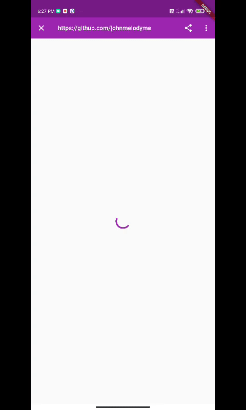

## SimpleInAppWebView
 
|                 | Android        | IOS     |
|-----------------|----------------|---------|
| **Requirement** | min 20+        | min 9.0 |

### Getting Started
This package render a webview for both `android` and `ios` and it is easy to implement.For `web` application it redirects or open up a new tab instead. 

### What so special?
This package is a plug and play, there are no neccessary code a webview from scratch. This package provide the feature of the following: 

1. Web a webpage from the assign url.
2. Share url to 3rd party application.
3. Option to open the url in the browser.

#### Demo: 


### How to use? 

1. Installation
    Add `simple_in_app_webview` to `pubspec.yaml`, and hit command `flutter pub get`.
    or
    run `flutter pub add simple_in_app_webview`

2. Implementation
   Before implementing, make sure you uderstand the `parameters`.

   ```dart
   SimpleWebView({
    Key? key,
    @required this.url,
    @required this.title,
    @required this.message,
    this.isUrlCentered = false,
    this.appBarColour = Colors.white,
    this.shareButtonColour = Colors.black,
    this.loadingIndicatorColour = Colors.black,
  }) : super(key: key);
  ```

  ```dart
  import 'package:simple_in_app_webview/simple_in_app_webview.dart';
  ```
  
  Example of calling the widget: 
  ```dart
   SimpleWebView(
        title: 'The title',
        message: 'description',
        url: 'https://someurlhere.com',
        appBarColour: Colors.purple, 
        isUrlCentered: false,
        loadingIndicatorColour: Colors.purple,
        shareButtonColour: Colors.white,
      ),
  ```

### Contribution: 
I Would ❤️ to see any contributions. If you do liked my work, show some ❤️ by ⭐ repo.

Also you can appreciate me by buy me a coffee:
<a href="https://www.buymeacoffee.com/johnmelodymel" target="_blank"></a>